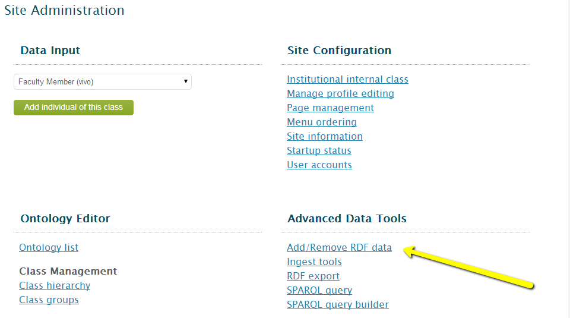

##VIVO sample data

August 3, 2014

This repository contains sample data that can be loaded into the [VIVO](http://vivoweb.org/) Semantic Web application.

This is intended to be a basic sample set of data that can be loaded into a fresh VIVO instance.  See the [VIVO Vagrant](https://github.com/lawlesst/vivo-vagrant) and [background information](https://wiki.duraspace.org/display/VIVO/Learning+about+VIVO) if you are interested in getting started with VIVO.

The data is mapped to the [VIVO ISF](https://wiki.duraspace.org/display/VIVO/VIVO-ISF+Ontology) ontology.  The VIVO ISF was introduced in VIVO version 1.6.

###Data source

 * [People](data/csv/people.csv)
 * [Organizations](data/csv/organizations.csv) - these are sample departments and schools for a given institution.
 * [Positions](data/csv/positions.csv)

###Loading the data
With a VIVO instance running at `http://localhost:8080/vivo/` login as an administrative user.  Go to Site Admin (top right hand corner) and click "Add/Remove RDF data".  Then upload the [all.ttl](data/rdf/all.ttl) file and select "Turtle from the dropdown menu."

After loading the data visit `http://localhost:8080/vivo/display/org102017` in your browser, assuming you are running VIVO locally.  This is the sample "Geothermal Technology Department" and has several members that you can browse.

###Mapping code
Python is used to map from the source CSV files to RDF in the VIVO-ISF ontology.  This code can be used as a reference for mapping local tabular data to RDF using the Python package [RDFLib](https://github.com/RDFLib/rdflib).

* [People](people.py)
* [Organizations](organizations.py)
* [Positions](positions.py)

The code makes use of [JSON-LD](http://www.w3.org/TR/json-ld/) [contexts](http://www.w3.org/TR/json-ld/#the-context) to map from Python lists of dictionaries with the attributes to RDF.  See the sample [organization context](organizations.py#L20).  These contexts could potentially be shared across VIVO implementers to ease the extracting transforming and loading process that makes up a large portion of the work required to get up and running with VIVO. 

###Tutorial
Two tutorials have been created with iPython notebooks as examples for those interested in getting started with Python, RDFLib and VIVO.  These tutorials use the sample files included in `data/csv` and the code utilities in [utils.py](utils.py).  

 * [People data loading example](http://nbviewer.ipython.org/github/lawlesst/vivo-sample-data/blob/master/tutorial/demo-vivo-ingest.ipynb)
 * [Fetching, converting and loading publication data from CrossRef](http://nbviewer.ipython.org/github/lawlesst/vivo-sample-data/blob/master/tutorial/publications-ingest.ipynb)